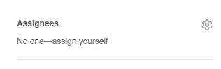

# About

This is a review tracker repository for Minecraft Datapacks discord server. It is currently experimental project to see how we can utilize github within our community.

# For Datapackers

Head to the [Issues](https://github.com/mc-datapacks/review-tracker/issues) tab using the top navbar and press "New issue", select the only template you can see and fill out the form.

# For Reviewers

When you want to review the datapack, you have to assign yourself to the issue as shown below. This let the other know that the datapack is already being review.

After you've finish reviewing and the datapack is ready to be certified, you have to assign a `Verified` label and close the issue as shown below.

If someone open an invalid issue (troll, spam, etc.), assign an `Invalid` label and close the issue.

